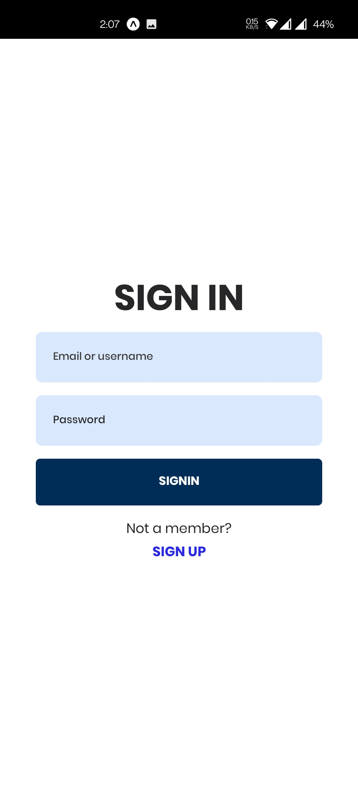

# Socializer

This is a social media app which is one of my largest personal project. The app features image or video posting, product promotion,
live post update and chat implementation with web socket. Notification of latest updates. Post search. Post promotion and more.

The project is currently 60% done which includes -

1. Live post update with web socket
1. Live like and comment to post update
1. Post creation with video or photo
1. Feed page
1. Authentication
1. Profile creation
1. Profile photo and banner update
1. backend api

Once the project is compele it will include -

1. Live chat
1. Post and product promotion
1. Product upload
1. Chat to buy
1. Search
1. Live notification

## Useage -

To use this project clone the repo -

```bash
    git clone https://github.com/jamilur-r/socializer.git
```

CD into the project directory

```bash
    cd socializer
```

Install packages

```bash
    cd api && yarn install
    cd ../tamuku && yarn install
```

create a nodemon.json file in root directry of "api". This file should contain project credentials like so -

```json

{
    "env": {
        "PORT": <POST-NUMBER>,
        "DB_URI": <DB-URL>,
        "SECRET": <16-DIGIT-SECRET-KEY>
    }
}

```

To start API server cd into "api" directory and run -

```bash
    yarn dev
```

or

```bash
    yarn build
```

for production build

To start app on expo cd into "tamuku" directory and run -

```bash
    yarn android

    or

    yarn ios
```

## Errors

You might face error connecting to local server from expo app. to solve this run -

```bash
    ipconfig
```

for windows and copy the ipv4 address which might be something like 192.168.0.107
now replace this in -

/tamuku/src/config/constants.ts

which looks something like this -

```typescript
export const API_ENDPOINT = "http://<REPLACE_HERE>:5000/";
export const POST_SERVER = "http://<REPLACE_HERE>:5001";
```

also replace the IPV4 address in

api/utils/utils.ts

```javascript
export const IP = "<REPLACE_HERE";
```


# Project Images 

<p align="center">
  
</p>

<p align="center">
  
</p>

<p align="center">
  
</p>

<p align="center">
  
</p>

<p align="center">
  
</p>
<p align="center">
  
</p>

<p align="center">
  
</p>

<p align="center">
  
</p>

